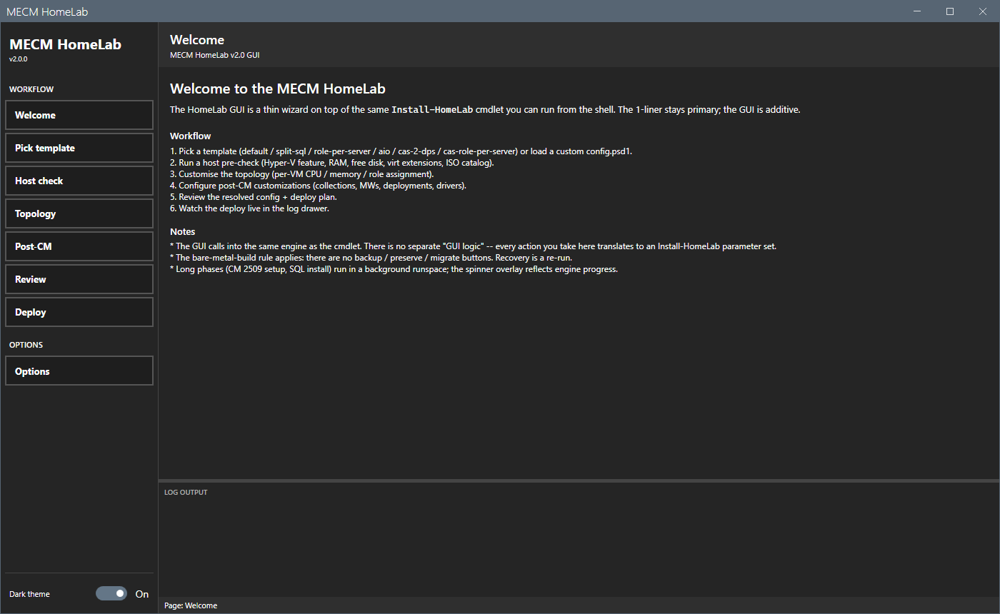
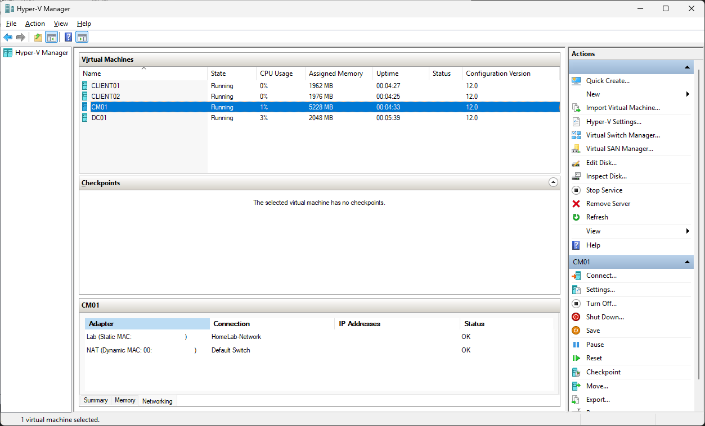
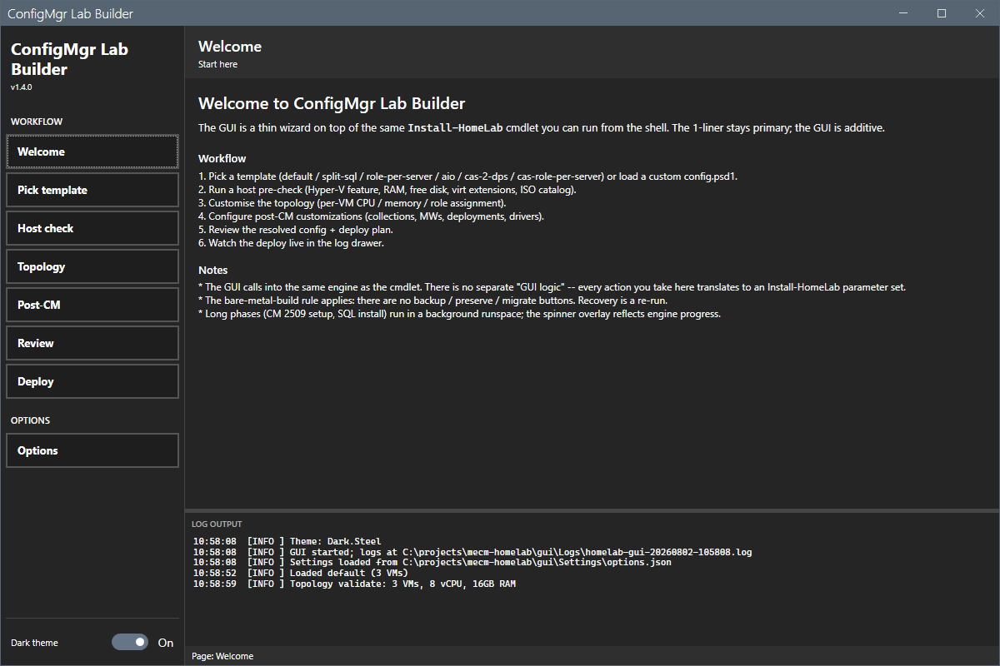
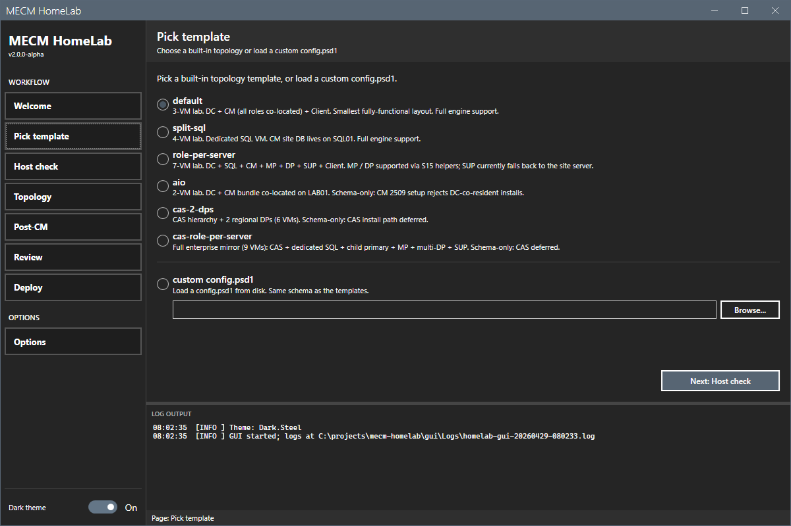
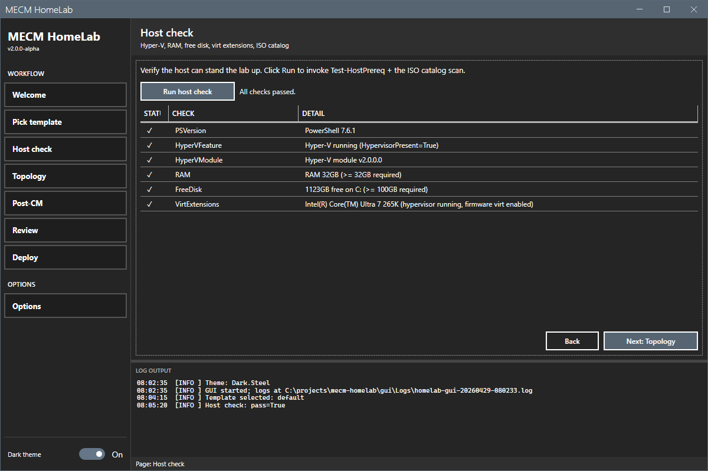
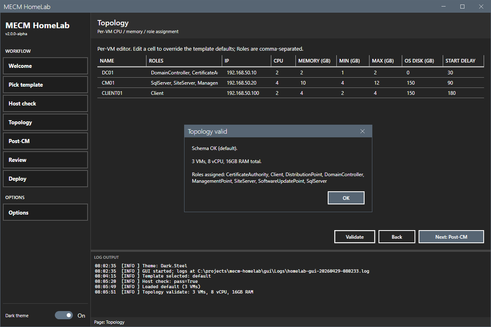
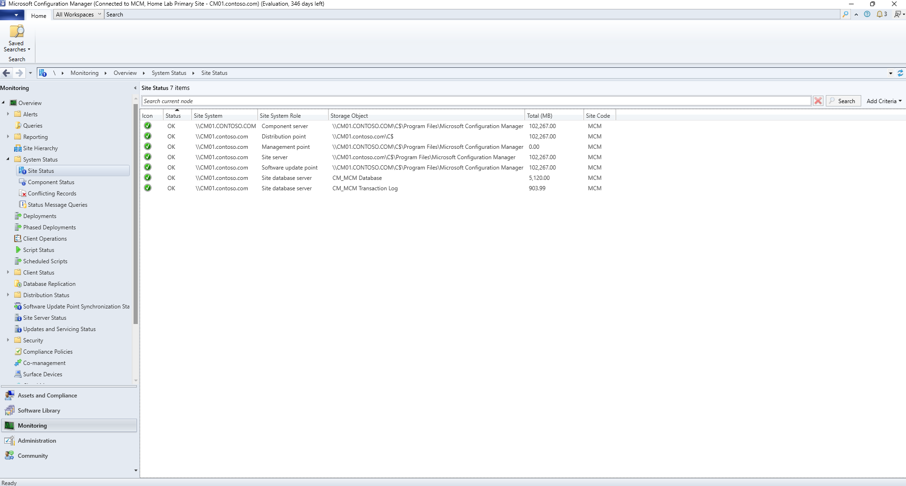

# ConfigMgr Lab Builder

Native PowerShell + Hyper-V engine that builds a fully-functional
Microsoft Configuration Manager 2509 home lab from a fresh
Windows host. One cmdlet, one wizard, no external module dependencies.

The lab is three VMs on an isolated Hyper-V vSwitch with NAT for OS
activation:

| VM | Role | IP | RAM | vCPU | OS |
|---|---|---|---|---|---|
| DC01 | Domain controller, root CA | 192.168.50.10 | 1-2 GB | 2 | Windows Server 2025 |
| CM01 | SQL Server 2022 + ConfigMgr 2509 site server / MP / DP | 192.168.50.20 | 4-12 GB | 4 | Windows Server 2025 |
| CLIENT01 | Windows 11 managed client | 192.168.50.100 | 2-4 GB | 2 | Windows 11 Enterprise |

Larger topologies (split SQL, role-per-server, CAS hierarchies) are
available via templates -- see [Templates](#templates).



## Hardware

| Resource | Minimum | Recommended |
|---|---|---|
| RAM | 32 GB | 64 GB |
| Disk (free) | 300 GB SSD/NVMe | 500 GB+ |
| CPU | 4 cores | 8+ cores |
| OS | Windows 10/11 Pro / Server 2022+ (Hyper-V capable) | Windows 11 Pro |

The lab is lighter at rest than the minimum suggests. Below is the
4-VM `two-clients` topology idling on the reference host: 11 GB of
assigned memory across all four VMs (DC01 2.0, CM01 5.2, CLIENT01 1.9,
CLIENT02 1.9) and 0-3% CPU.



Every VM runs on Dynamic Memory, so those are idle figures, not
ceilings -- CM01 is provisioned 4-12 GB and will climb toward the top
of that band during CM setup, content distribution, and OSD. Size the
host for the peak, not for this screenshot.

## Software prerequisites

PowerShell 7.6 LTS (or newer) is required on the host orchestrator.
Install via `winget install Microsoft.PowerShell`.

The engine installs Hyper-V itself if it is missing. Reboot if the
feature install reports `RebootRequired`, then re-run.

Two host dependencies the engine manages or checks for you:

- **Name resolution**: Phase 02 writes `# HomeLab-managed` hosts-file
  entries for every lab VM (the host is not in the lab domain, so its
  DNS knows nothing about it). `Remove-HomeLab` strips them.
- **WinRM TrustedHosts**: connecting to workgroup/other-domain VMs
  over NTLM requires the lab VM names in the WinRM client's
  TrustedHosts. Phase 01 verifies coverage and fails with the exact
  elevated `Set-Item` command to fix it.

Phase 01 also checks that the topology's summed startup memory
actually fits the host's currently-available RAM (free + memory
reclaimable from existing lab VMs) -- total RAM meeting the minimum
is not enough if your desktop session holds the balance.

Stage these external assets before running. Paths default under
`C:\LabSources` (overridable in `config.psd1` or via the GUI
Options panel):

| File | Default path | Source |
|---|---|---|
| Windows Server 2025 Eval ISO | `C:\LabSources\ISOs\` | https://www.microsoft.com/en-us/evalcenter/evaluate-windows-server-2025 |
| Windows 11 Enterprise Eval ISO | `C:\LabSources\ISOs\` | https://www.microsoft.com/en-us/evalcenter/evaluate-windows-11-enterprise |
| SQL Server 2022 Eval ISO | `C:\LabSources\ISOs\` | https://www.microsoft.com/en-us/evalcenter/download-sql-server-2022 (downloads a bootstrapper; run it and pick "Download Media" for the ISO) |
| ConfigMgr 2509 baseline (extracted) | `C:\LabSources\SoftwarePackages\CM\ConfigMgr_2509\` | https://www.microsoft.com/en-us/evalcenter/download-microsoft-endpoint-configuration-manager (extract with 7-Zip into the `ConfigMgr_2509` subfolder) |
| ADK offline layout | `C:\LabSources\SoftwarePackages\ADK\Offline\` | `adksetup.exe /quiet /layout C:\LabSources\SoftwarePackages\ADK\Offline` (downloader: https://go.microsoft.com/fwlink/?linkid=2289980) |
| WinPE offline layout | `C:\LabSources\SoftwarePackages\ADKPE\Offline\` | `adkwinpesetup.exe /quiet /layout C:\LabSources\SoftwarePackages\ADKPE\Offline` (downloader: https://go.microsoft.com/fwlink/?linkid=2289981) |
| VC++ 14.50 redist (x64 + x86) | `C:\LabSources\SoftwarePackages\VCRedist\` | https://aka.ms/vs/18/release/vc_redist.x64.exe and `...x86.exe` (flat `SoftwarePackages\` also works) |
| ODBC Driver 18.5.2.1 MSI | `C:\LabSources\SoftwarePackages\ODBC\msodbcsql.msi` | https://go.microsoft.com/fwlink/?linkid=2335671 (NOT 18.6.x; documented NULL regression breaks CM) |
| MSOLEDB SQL 19 MSI | *(not needed)* | CM 2509 setup installs its own OLE DB driver and enforces the site DB connection over ODBC (verified in ConfigMgrSetup.log). The engine skips MSOLEDB pre-install unless you explicitly pass `-MsOleDbMsiPath` -- if you do, stage the **x64** MSI. |

OS edition names are detected automatically from each ISO's
`install.wim`. Wildcard filters in `config.psd1`
(`ServerOSFilter`, `ClientOSFilter`) match any edition (Datacenter,
Standard, Eval, retail).

## Two ways to deploy

| Path | When to use |
|---|---|
| **GUI wizard** | First-time deploy, exploring topologies, building a custom config visually. The wizard composes the same `Install-HomeLab` call. |
| **Cmdlet** | Repeatable deploys, scripted automation, CI scenarios. The cmdlet is the engine; the GUI is a thin layer on top. |

Both paths land at the same place. Pick whichever fits the moment.

## GUI walkthrough

Launch the wizard from an elevated PowerShell 7 session, working
directory at the project root:

```powershell
pwsh -NoProfile -File .\gui\start-homelab-gui.ps1
```

The wizard runs every step in-process; long phases (CM 2509 setup,
SQL install) execute in a background runspace so the spinner stays
animated and the log drawer streams live.

### 1. Welcome



Cover page with the six-step workflow summary. No input; click
**Pick template** in the sidebar (or Next) to begin.

### 2. Pick template



Radio-button picker for the seven built-in topologies (see
[Templates](#templates)) plus an option to load a custom
`config.psd1` from disk. The choice maps directly to the
`-Template` (or `-ConfigPath`) parameter on `Install-HomeLab`.

### 3. Host check



Runs `Test-HostPrereq` plus an ISO catalog scan and reports each
check (PowerShell version, Hyper-V feature state, RAM, free disk,
virtualisation extensions, elevation, ISO discovery) in a status
grid with a glyph-only status column (no red/green per the
brand spec).

Failures here block the deploy; warnings (e.g. RAM below
recommended but above minimum) do not.

### 4. Topology



Per-VM editor backed by the resolved template. Edit any cell to
override the template defaults: `Name`, `Roles` (comma-separated),
`IP`, `CPU`, `Memory (GB)`, `Min (GB)`, `Max (GB)`, `OS Disk (GB)`,
`Start Delay`. The **Validate** button runs the same schema check
the engine uses at config-load time -- IPs in the network prefix,
exactly one DomainController, MinMemory <= MaxMemory, and so on.

### 5. Post-CM

Optional day-2 customizations applied after the site is healthy.
Each section is independent; uncheck to skip:

- **Collections** -- `All Workstations`, `All Servers`,
  `HomeLab - Test Deployments` (direct member: CLIENT01).
- **Maintenance windows** -- Patch Saturday 02:00-06:00
  (SoftwareUpdates only, on All Workstations) and Daily
  00:00-06:00 (Any, on the test collection).
- **Driver categories** -- comma-separated Vendor-Model pairs,
  consumed by OSD task sequences.
- **Applications (app-packager import)** -- path to an
  app-packager output folder; each subfolder with a
  `stage-manifest.json` becomes a CM Application + Script DT +
  registry detection rule.
- **OSD** -- WinPE boot image (from Phase 07 ADK offline layout)
  and a `Build Win11` task sequence stub
  (`InstallOperatingSystemImage` TS).

### 6. Review

Three read-only summary panes: resolved topology, post-CM
customizations selected, and the deploy plan (phases that will
run, in order). Last chance to back out.

### 7. Deploy

Click **Start deploy**. The wizard hands the resolved config to
`Install-HomeLab` running in a background runspace. The page
shows:

- A live status text and animated spinner.
- A phase list (`waiting` -> `running` -> `done`).
- A progress bar across all phases.
- The shell's log drawer streams every engine `[OK]` / `[RUN]` /
  `[WARN]` / `[FAIL]` line as it lands.

**Cancel** flips a flag the worker checks between phases -- a
phase already in flight (e.g. CM 2509 setup) finishes; the next
one does not start.

When the deploy finishes, the deploy summary block prints to the
log drawer with VM table, service health, accounts, applied
post-CM flags, and paths.

### Options

Sidebar item, not part of the linear flow. Configures
preferences:

- **Paths** -- `LabSourcesRoot`, `LabImagePath`, parallel-throttle
  (1..16; default 3 = number of parallel VM provisioning +
  domain-join workers).
- **Logging** -- log-drawer verbosity (Quiet / Normal / Verbose),
  show-timestamps toggle, file-log paths.
- **Defaults** -- pre-checked Post-CM toggles persisted between
  launches.
- **About** -- version + project URL + settings file path.

Theme toggle (Dark.Steel / Light.Blue) lives on the sidebar
header, per the brand spec.

## Cmdlet quick start

Edit `config.psd1` to change every default password (or pass
`-LabPassword` to the cmdlet -- see below). From an elevated
PowerShell 7 session, working directory at the project root:

```powershell
Import-Module .\modules\HomeLab\HomeLab.psd1
Install-HomeLab
```

A non-interactive deploy with an explicit password and a
non-default topology:

```powershell
$pw = ConvertTo-SecureString 'Your-Lab-Password!' -AsPlainText -Force
Install-HomeLab -Template role-per-server -LabPassword $pw -ParallelThrottle 4
```

Same call with post-CM customizations enabled:

```powershell
Install-HomeLab -LabPassword $pw -PostCmConfig @{
    Coll_AllWorkstations = $true
    Coll_AllServers      = $true
    Coll_TestDirect      = $true
    MW_PatchSaturday     = $true
    MW_TestDaily         = $true
    Osd_BootImage        = $true
    Osd_TaskSequenceStub = $true
}
```

Measured on the reference host (20 threads / 32 GB, NVMe): a first
deploy from ISOs takes **~1h 10m** (both audit-gated verification
runs landed there), roughly 25-30 minutes of which is the one-time
sysprepped base-image build. A full teardown-and-rebuild that reuses
the cached base images runs **~45-65 minutes** depending on topology
(measured: 1h 05m for the 4-VM `two-clients` template) -- the CM
2509 site install dominates and does not cache. A re-run against an
already-healthy lab finishes in well under ten minutes thanks to the
idempotent `AlreadyExists` / `AlreadyInstalled` / `AlreadyPromoted`
phase probes.

## Templates

Seven built-in topology templates ship in `templates/`:

| Template | VMs | Engine support | When to use |
|---|---|---|---|
| `default` | 3 | Full | Smallest fully-functional lab. DC + CM (all roles co-located) + Client. |
| `two-clients` | 4 | Full | Default plus a second Windows 11 client, so app install/uninstall and supersedence testing gets a clean-machine control instead of checkpoint rollbacks. |
| `split-sql` | 4 | Full | Mirrors enterprise tier-2: dedicated SQL VM. CM site DB lives on SQL01. |
| `role-per-server` | 7 | Partial (SUP falls back to site server) | Mirrors enterprise tier-1: each CM role on its own VM. |
| `aio` | 2 | Schema-only | DC + CM bundle on one VM. CM 2509 setup rejects DC-co-resident installs; this template documents the topology but will not produce a working lab. |
| `cas-2-dps` | 6 | Schema-only | CAS hierarchy + 2 regional DPs. Orchestrator rejects CAS until CAS install + replication ships in a future tag. |
| `cas-role-per-server` | 9 | Schema-only | Full enterprise mirror: parent CAS + child primary + dedicated SQL + MP + multi-DP + SUP. Same CAS deferral as above. |

Pass via `-Template <name>` or copy any template to your own path
and pass via `-ConfigPath`. The two parameters are mutually
exclusive.

## Post-CM Customizations

`-PostCmConfig` accepts a hashtable of opt-in flags applied
after the site is healthy. Each flag is independent; defaults
are all `$false`.

| Flag | What it builds |
|---|---|
| `Coll_AllWorkstations` | Device collection `All Workstations`, query-rule on workstation OS family. |
| `Coll_AllServers` | Device collection `All Servers`, query-rule on server OS family. |
| `Coll_TestDirect` | Device collection `HomeLab - Test Deployments`, direct membership = CLIENT01 (or first Client VM). |
| `MW_PatchSaturday` | Maintenance window `Patch Saturday 02:00-06:00` on `All Workstations`, weekly, SoftwareUpdates only. |
| `MW_TestDaily` | Maintenance window `Daily 00:00-06:00 (test)` on the test collection, daily, Any. |
| `Osd_BootImage` | WinPE x64 boot image imported from the ADK offline layout, distributed to all DPs. |
| `Osd_TaskSequenceStub` | `Build Win11` task sequence stub (`InstallOperatingSystemImage` TS) wired up with the imported OS image, boot image, and `svc-CMJoin` for domain-join. |

The GUI's Post-CM page (see [Post-CM panel](#5-post-cm)) maps
each checkbox to one of these flags.

## Configuration

`config.psd1` (or any of the templates) holds every knob:

| Setting | Notes |
|---|---|
| `LabName`, `DomainName`, `SiteCode`, `SiteName`, `Network` | Lab identity |
| `AdminUser` | Domain admin sAMAccountName (post-promotion) |
| `ServerOSFilter`, `ClientOSFilter` | Wildcards matched against ISO contents |
| `DC` / `CM` / `Client` blocks (or canonical `VMs[]`) | Per-VM RAM / CPU / disks / IP / auto-start delay |
| `ServiceAccounts.{ClientPush,NAA,Join}` | sAMAccountName + password + group memberships |
| `AutoStartAction` / `AutoStopAction` | Hyper-V host-boot behaviour |
| `ODBCVersion`, `ODBCURL`, `VCRedistX64URL`, `VCRedistX86URL` | External-asset URLs / pinned versions |

Passwords come from one of (in order): `-LabPassword` parameter,
`$cfg.AdminPass` in the config file, the `HOMELAB_PASSWORD`
environment variable. **Default passwords are published in source
control** -- the engine warns at startup; change them before
deploying to anything you care about.

## Public surface

The HomeLab module exports seven cmdlets:

| Cmdlet | What it does |
|---|---|
| `Install-HomeLab` | End-to-end deploy. Phases 01-Prereq through 11-PostCM, each independently idempotent. |
| `Remove-HomeLab` | Provable teardown: removes lab VMs (including strays from other configs, discovered by disk location), VHDX chains, checkpoints, the lab vSwitch, engine-managed hosts entries, and temp debris. `-KeepBaseImages` preserves the image cache for fast rebuilds; `-RemoveBaseImageCache` wipes everything. Verify with `tools\Audit-HomeLabArtifacts.ps1`. |
| `Test-HomeLab` | Per-VM health probe (state / WinRM / AD / SQL / SMS_EXECUTIVE / CM provider / domain join). Aggregate `OverallReady`. |
| `Start-HomeLab` | Start in dependency order: DC -> CM -> CLIENT, with WinRM gates between each. |
| `Stop-HomeLab` | Graceful Stop-VM in reverse order; `-TurnOff` for crash-stop. |
| `Connect-HomeLabVM` | `vmconnect.exe` wrapper to a lab VM's console. |
| `Enter-HomeLabSession` | `Enter-PSSession` via the cached pool. |

Internal helpers (INI roundtrip, base-image cache, per-VM
Unattend, session pool, the dozens of CM-cmdlet wrappers) are
not exported; the module surface is intentionally small.

`Test-HomeLab` example:

```powershell
$pw = ConvertTo-SecureString 'Your-Lab-Password!' -AsPlainText -Force
Test-HomeLab -LabPassword $pw | ConvertTo-Json -Depth 3
```

Returns a structured report with per-VM `State` / `WinRM` / role
checks plus an `OverallReady` boolean.

## After deployment

You get a real site, not a site that merely finished installing. All
seven site systems report OK on first console launch -- component
server, management point, distribution point, site server, software
update point, and both database objects -- under site code `MCM` on
`CM01.contoso.com`.



The site installs under the CM 2509 evaluation license -- 365 days
from install, which the console title bar counts down (346 left in the
shot above). Plan on a rebuild or a product key before it expires.

Service accounts (created in `OU=Service Accounts,DC=contoso,DC=com`):

| Account | Purpose | Group memberships |
|---|---|---|
| `CONTOSO\LabAdmin` | Lab admin (orchestrator + CM Full Administrator) | Domain Admins |
| `CONTOSO\svc-CMPush` | Client Push Installation | Domain Admins |
| `CONTOSO\svc-CMNAA` | Network Access Account | Domain Users only |
| `CONTOSO\svc-CMJoin` | OSD task sequence domain-join account | Domain Admins + Remote Desktop Users |

CM 2509 setup auto-grants the user that ran `setup.exe` the Full
Administrator role; the engine runs setup as `LabAdmin`, so
`LabAdmin` is the lab's Full Administrator without an explicit
`Add-CMAdministrativeUser` call.

Content share:

| Detail | Value |
|---|---|
| UNC | `\\CM01\ContentShare$` |
| Local | `C:\ContentShare` |
| Full Access | `CONTOSO\Domain Admins`, `NT AUTHORITY\SYSTEM` (share level -- Distribution Manager reads the package source as SYSTEM over loopback UNC) |
| Read | `CONTOSO\Domain Computers`, `CONTOSO\svc-CMNAA`, `CONTOSO\CM01$` |

Test collection: `HomeLab - Test Deployments`, limited by
`All Desktop and Server Clients`, incremental (Continuous) refresh,
membership via a name-scoped query rule on the first Client VM (plus
a direct rule once the device record exists -- the query rule makes
membership survive the fact that the collection is created before AD
discovery has ever run), and a daily 00:00-06:00 maintenance window.

CCMCache: 40 GB on the default client settings.

## Logs

| Stream | Path | Format |
|---|---|---|
| Engine (text) | `C:\ProgramData\HomeLab\Logs\HomeLab-<yyyy-MM-dd>.log` | Aligned columns, one line per event |
| Engine (structured) | `C:\ProgramData\HomeLab\Logs\HomeLab-<yyyy-MM-dd>.log.json` | One JSON object per line; consumable by tooling |
| GUI (per-session) | `gui\Logs\` next to `start-homelab-gui.ps1` | Mirrors the engine text log, scoped to the GUI run |
| ConfigMgr setup (on CM01) | `C:\ConfigMgrSetup.log` | The authoritative source for any CM 2509 install issue |

When a deploy fails, the engine log is the source of truth.
`Test-CMSetupLog` reads `C:\ConfigMgrSetup.log` remotely and
returns a structured Status (Success / Failure / InProgress)
with the matching log line and 50 lines of error context.

## Re-deploys

`Install-HomeLab` is idempotent. Every phase (Prereq, Network, Image,
VM, Domain, SQL, CM Prereqs, CM, CMConfig, Tools, PostCM) probes
existing state and short-circuits on `AlreadyExists` /
`AlreadyInstalled` / `AlreadyPromoted`. If a deploy fails midway --
or you just want to apply a config change to an existing lab --
re-run `Install-HomeLab`; it picks up at the first incomplete phase.
A no-op re-run against a healthy lab finishes in well under ten
minutes.

To wipe the lab and start fresh from the cached sysprepped base
images (~45-65 minutes measured; the CM site install dominates and
does not cache):

```powershell
Remove-HomeLab -KeepBaseImages
Install-HomeLab
```

To force a full from-scratch rebuild including the base-image cache
(~1h 10m measured on the reference host):

```powershell
Remove-HomeLab -RemoveBaseImageCache
Install-HomeLab
```

## Verified teardown and rebuild

The engine's rebuild story is provable, not aspirational. Two tools
make it so:

- **`tools\Audit-HomeLabArtifacts.ps1`** enumerates every artifact
  class a lab run creates on the host -- VMs (including strays from
  older or renamed configs, found by disk location), checkpoints, lab
  vSwitches, cached base images, orphaned or half-built VHDXs, leaked
  ISO/VHD mounts, hosts-file entries, temp debris -- and exits 0 only
  when the host is provably clean. `-AllowBaseImageCache` exempts the
  image cache for the `-KeepBaseImages` workflow. Run it after any
  teardown; trust the exit code, not vibes.
- **`tools\Invoke-VerifiedE2E.ps1`** chains the whole loop under a
  transcript: teardown, audit gate (aborts unless the audit exits 0),
  `Install-HomeLab`, `Test-HomeLab`. `-KeepBaseImages` runs the
  cache-reuse variant; `-Template` picks a topology. The transcript
  in `%ProgramData%\HomeLab\Logs` is the evidence that the build
  started from a clean slate and ended healthy.

This exists because a build once silently consumed a stale cached
image that an incomplete teardown left behind, and nobody noticed
until review. The audit gate makes that class of mistake impossible
to miss.

## Troubleshooting

### Hyper-V was just enabled and `Install-HomeLab` says reboot required

Reboot. Re-run `Install-HomeLab`.

### `Install-HomeLab` cannot find an ISO

Either the file is missing or the wildcard pattern in `config.psd1`
does not match. Check:

```powershell
Get-ChildItem C:\LabSources\ISOs\*.iso
```

Or pass explicit paths: `Install-HomeLab -ServerIsoPath ... -ClientIsoPath ... -SqlIsoPath ... -CMSourcePath ...`

### CM setup hangs / fails

The log is the source of truth. From the host:

```powershell
$cred = Get-Credential CONTOSO\Administrator
Invoke-Command -ComputerName CM01.contoso.com -Credential $cred -ScriptBlock {
    Get-Content 'C:\ConfigMgrSetup.log' -Tail 80
}
```

`Test-CMSetupLog -ComputerName CM01.contoso.com -DomainCredential $cred`
returns a structured Status (Success / Failure / InProgress) with
the matching log line and 50 lines of error context.

### CM cmdlet calls in Phase 09+ fail with "Cannot bind argument to parameter 'Path'"

CM 2509 setup writes the machine-wide `SMS_ADMIN_UI_PATH`
environment variable; existing PSSessions from earlier phases
inherited the WinRM service's stale environment. Either restart
WinRM on CM01 (`Restart-Service WinRM`) or just re-run
`Install-HomeLab` -- the engine refreshes from the Machine
environment in every CM-cmdlet script block.

### OS edition not in the ISO

```powershell
Mount-DiskImage -ImagePath C:\LabSources\ISOs\<file>.iso
Get-WindowsImage -ImagePath '<drive>:\sources\install.wim'
```

Update `ServerOSFilter` / `ClientOSFilter` in `config.psd1` to match.

### CM01 OS disk full

CCMCache + content distribution can fill the OS volume. Resize:

```powershell
Stop-VM -Name CM01
Resize-VHD -Path (Get-VMHardDiskDrive -VMName CM01 | Where-Object ControllerLocation -eq 0).Path -SizeBytes 200GB
Start-VM -Name CM01
$cred = Get-Credential CONTOSO\Administrator
Invoke-Command -ComputerName CM01.contoso.com -Credential $cred -ScriptBlock {
    Resize-Partition -DriveLetter C -Size (Get-PartitionSupportedSize -DriveLetter C).SizeMax
}
```

## Architecture

```
configmgr-lab-builder/
    config.psd1                         # Default lab knobs
    CHANGELOG.md
    README.md
    docs/                               # Architecture, migration, cookbook
    gui/                                # WPF wizard (PS + MahApps)
        start-homelab-gui.ps1           # Entry script
        MainWindow.xaml                 # Shell: sidebar + content + log drawer
        Lib/                            # Vendored MahApps + ControlzEx + Behaviors
        Pages/                          # Per-step UserControls
    modules/
        HomeLab/
            HomeLab.psd1                # Module manifest (PS 7.6 LTS, .NET 10)
            HomeLab.psm1                # Dot-source loader
            Public/                     # The 7 exported cmdlets
            Helpers/                    # INI / log / config / cred / wait / session / invoke / copy / MAC
            Private/
                01-Prereq/              # Test-HostPrereq, Install-LabHyperV, Resolve-IsoEdition
                02-Network/             # New-LabSwitch, Set-LabHostsEntries
                03-Image/               # New-LabBaseImage (the keystone), cache key, base unattend
                04-VM/                  # New-LabVhdx, New-Unattend, Mount-LabUnattend, New-LabVM, Wait-LabVM
                05-Domain/              # Install-LabDC, Install-LabRootCA, Add-LabSchemaContainer,
                                        #   Join-LabDomain, New-LabServiceAccounts,
                                        #   Enable-LabClientPushFirewall
                06-Sql/                 # New-LabSqlConfigIni, Install-LabSqlServer,
                                        #   Set-LabSqlMemory, Set-LabSqlFirewall
                07-CMPrereqs/           # VC++, ODBC, MSOLEDB, ADK, WinPE, WSUS, Defender exclusions
                08-CM/                  # New-CMUnattendIni, Install-CMSite, Test-CMSetupLog,
                                        #   Wait-CMReady, Import-CMModule, Resolve-CMSetupLogStatus
                09-CMConfig/            # Discovery / boundary / SUP / boundary group / DP / MP / accounts
                10-Tools/               # Copy-CMTools, Set-LabAutoStartStop
                11-PostCM/              # Collections, MWs, boot image, OS image, TS stub, applications
    templates/                          # Seven built-in topology templates
    tools/                              # Audit-HomeLabArtifacts, Invoke-VerifiedE2E,
                                        #   Watch-Deploy, Deploy-AllApps
```
